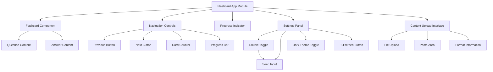
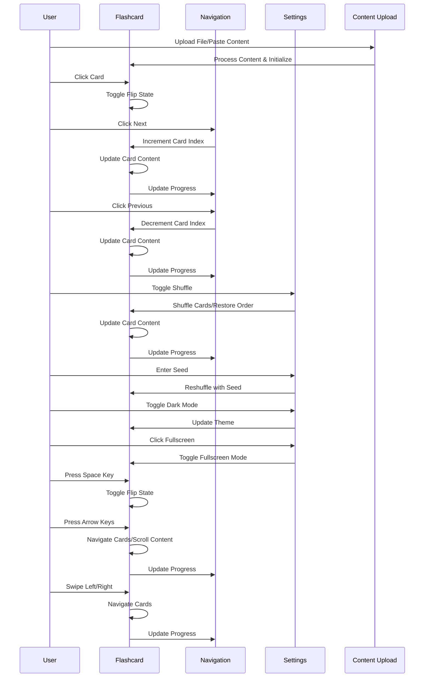
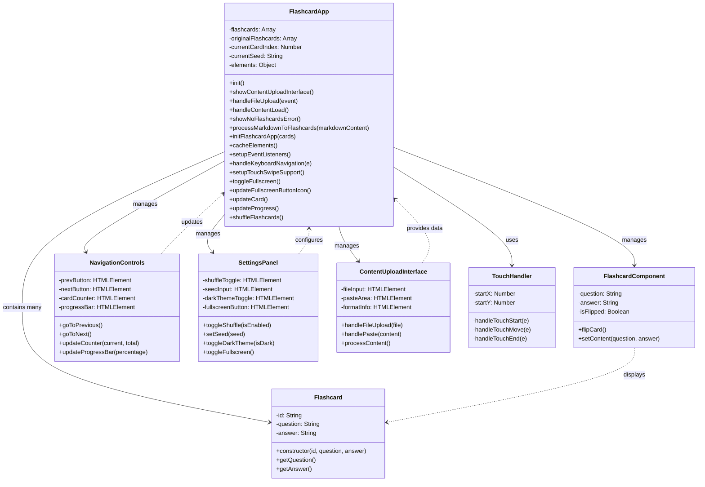

# 📚 Modern Flashcard App - Technical Diagrams ✨

This document contains the technical diagrams for the Modern Flashcard App, including component structure, event handling, and class relationships.

## 📊 Component Diagram

## 🔄 Event Handling Diagram

## 📊 Class Diagram

## 🧩 Component Descriptions

### Main Components
- **Flashcard Component**: The core component that displays questions and answers
- **Navigation Controls**: Buttons and indicators for moving between cards
- **Progress Indicator**: Visual representation of progress through the deck
- **Settings Panel**: Controls for shuffle, dark mode, and fullscreen features
- **Content Upload Interface**: Interface for loading flashcard content

### Event Handling
- **Card Flipping**: Triggered by clicking the card or pressing space
- **Navigation**: Triggered by buttons, arrow keys, or swipe gestures
- **Shuffle Management**: Handles shuffling cards with optional seed-based consistency
- **Theme Switching**: Toggles between light and dark themes
- **Fullscreen Mode**: Manages entering and exiting fullscreen mode
- **Content Loading**: Processes uploaded files or pasted content
